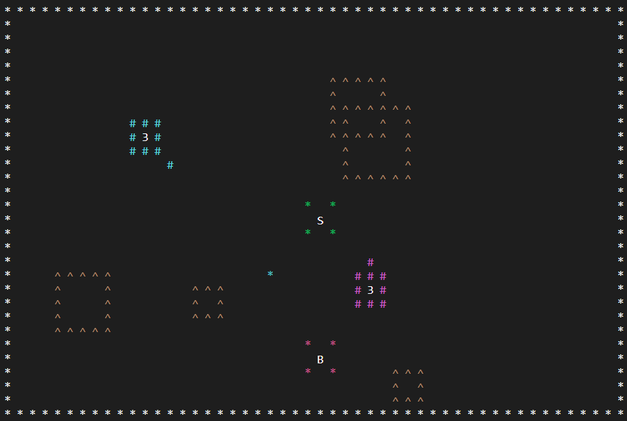

# Tank Game

This a two-player tank game wherein players with three lives each try to shoot one another **within the terminal**!

It is made using my [python canvas module](https://github.com/therealmudd/python-canvas) and some OOP.



## Features

- 8-directional movement
- Bullets
- Pick-ups
- Obstacles

## Usage

Firstly, make sure that you have the [keyboard module](https://pypi.org/project/keyboard/). You can install it using pip in the terminal:

```pip install keyboard```

_OR_

```pip install -r requirements.txt```

Next, you can run the program using:

```python tanks.py```

> Note: I've found that Linux doesn't like the keyboard module, so try using ```sudo python3 tanks.py```.

Player 1 uses WASD and R to move and shoot.\
Player 2 uses IJKL and P to move and shoot.

_You can also change this in the code._

## Improvements

- Currently moving diagonally moves the player faster than horizontally or vertically. This requires a slight fix, but I got lazy. 😅

- Obstacle generation could be improved. Currently obstacles can spawn on top of players or other obstacles.

Feel free to mention any suggestions.

--- 
Happy coding!
